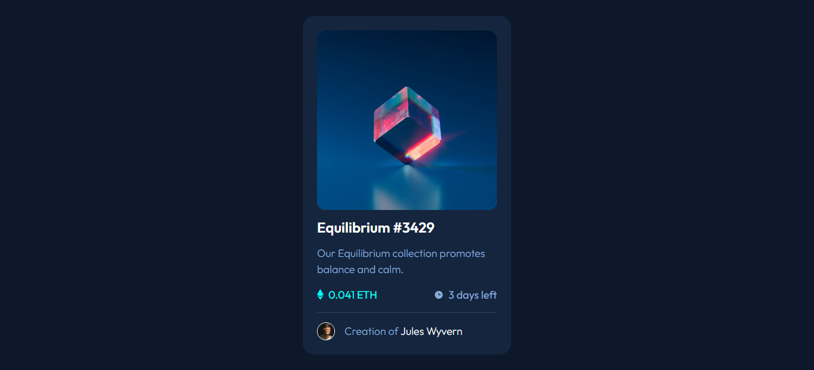

# Frontend Mentor - NFT preview card component solution

This is my solution to the [NFT preview card component challenge on Frontend Mentor](https://www.frontendmentor.io/challenges/nft-preview-card-component-SbdUL_w0U). Frontend Mentor challenges help you improve your coding skills by building realistic projects. 

## Table of contents

- [Frontend Mentor - NFT preview card component solution](#frontend-mentor---nft-preview-card-component-solution)
  - [Table of contents](#table-of-contents)
  - [Overview](#overview)
    - [The challenge](#the-challenge)
    - [Screenshot](#screenshot)
    - [Links](#links)
  - [My process](#my-process)
    - [Built with](#built-with)
    - [What I learned](#what-i-learned)
  - [Author](#author)
  - [Acknowledgments](#acknowledgments)

## Overview

### The challenge

Users should be able to:

- View the optimal layout depending on their device's screen size
- See hover states for interactive elements

### Screenshot



### Links

- Solution URL: [NFT preview card component with Flexbox](https://www.frontendmentor.io/solutions/nft-preview-card-component-with-flexbox-fkyyJZomSE)
- Live Site URL: [nft-co](https://nft-co.netlify.app/)

## My process

### Built with

- Semantic HTML5 markup
- CSS custom properties
- Flexbox

### What I learned

Learned to add a **background-image** on a figure, so the image within it can have a hover effect.

See the code snippets below for more 👇:

```html
<figure class="component__figure">
  
  <figcaption class="offscreen">Equilibrium</figcaption>
</figure>
```
```css
.component__figure {
    background-image: url('../images/icon-view.svg');
    background-position: center;
    background-repeat: no-repeat;
    background-color: var(--LIGHT-CYAN);
    color: var(--WHITE);
    border-radius: 0.9375rem;
    cursor: pointer;
}

.component__img {
    border-radius: 0.9375rem;
}

.component__img:hover {
    opacity: 0.3;
}

.offscreen {
    position: absolute;
    left: -62.5rem;
}
```

## Author

- Frontend Mentor - [@lamy](https://www.frontendmentor.io/profile/Lamy237)
- Twitter - [@Lamy237](https://www.twitter.com/Lamy237)

## Acknowledgments

- [Stack Overflow: CSS background image on top of img](https://stackoverflow.com/questions/28710659/css-background-image-on-top-of-img)
